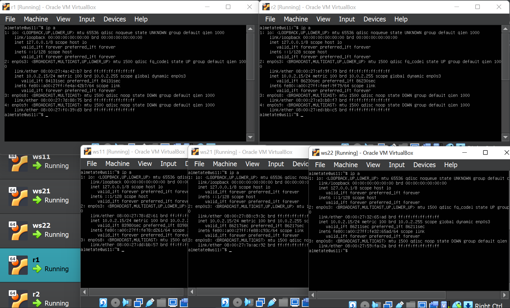
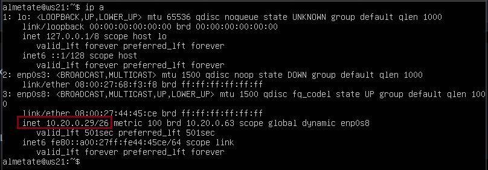
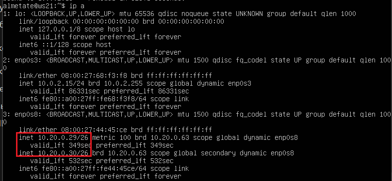
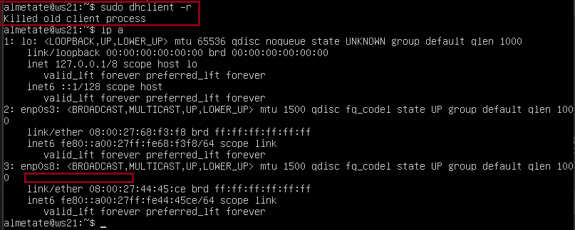

# Linux Network

## Содержание

1. [Инструмент ipcalc](#part-1-инструмент-ipcalc)
2. [Статическая маршрутизация между двумя машинами](#part-2-статическая-маршрутизация-между-двумя-машинами)
3. [Утилита ipref3](#part-3-утилита-ipref3)
4. [Сетевой экран](#part-4-сетевой-экран)
5. [Статическая маршрутизация сети](#part-5-статическая-маршрутизация-сети)
6. [Динамическая настройка IP с помощью DHCP](#part-6-динамическая-настройка-ip-с-помощью-dhcp)
7. [NAT](#part-7-nat)
8. [Дополнительно. Знакомство с SSH Tunels](#part-8-дополнительно-знакомство-с-ssh-tunnels)

---
## Part 1. Инструмент ipcalc
---
>ipcalc предоставляет простой метод для вычисления IP-информации хоста. Различные опции определяют, какую информацию ipcalc должен вывести на стандартный выход. Могут быть заданы несколько опций. Обрабатываемый IP-адрес всегда должен быть указан.

**Опции ipcalc:**

- -n (--nocolor)
подавить вывод цветов.
- -b (--nobinary)
подавить поразрядный вывод.
- -с (--class)
показать маску сети по адресу.
- -h (--html)
показать результаты в HTML.
- -v (--version)
dверсия программы.
- -r (--range) 
исключить диапазон адресов.

### 1.1. сети и маски

1) __адрес сети 192.167.38.54/13__

определение адреса сети 192.167.38.54/13 `ipcalc (ip)`

> Чтобы получить адрес сети, зная IP-адрес и маску подсети, необходимо применить к ним операцию поразрядной конъюнкции (побитовое И)

адрес сети: 192.160.0.0

2) __перевод маски 255.255.255.0 в префиксную и двоичную запись, /15 в обычную и двоичную, 11111111.11111111.11111111.11110000 в обычную и префиксную__

>Существует три способа записи маски подсети десятичная(обычная), двоичная, префиксная

- `ipcalc 255.255.255.0`

- `ipcalc /15`

- ненулевых бит - 28 соответтсвенно постфиксная запись - /28 и можно ввести следующую команду 

`ipcalc /28`

3) __минимальный и максимальный хост в сети 12.167.38.4 при масках: /8, 11111111.11111111.00000000.00000000, 255.255.254.0 и /4__

    Для определения минимального и максимального будем писать `ipcalc 12.167.38.4/(запись маски в префиксном виде)`. Значение максимального в строке (HostMax), минимального (HostMin)

### 1.2. localhost
__Определить и записать в отчёт, можно ли обратиться к приложению, работающему на localhost, со следующими IP: 194.34.23.100, 127.0.0.2, 127.1.0.1, 128.0.0.1__

> localhost (так называемый, «местный» от англ. local, или «локальный хост», по смыслу — этот компьютер) — в компьютерных сетях, стандартное, официально зарезервированное доменное имя для частных IP-адресов (в диапазоне 127.0.0.1 — 127.255.255.254

    следовательно все адреса которые начинаются с 127 можно обращаться.

    Можно обратиться к приложению с IP: 127.0.0.2/24, 127.1.0.1/8

    Нельзя обратиться к приложению с IP: 194.34.23.100, 128.0.0.1

### 1.3. Диапазоны и сегменты сетей

1) __какие из перечисленных IP можно использовать в качестве публичного, а какие только в качестве частных: 10.0.0.45, 134.43.0.2, 192.168.4.2, 172.20.250.4, 172.0.2.1, 192.172.0.1, 172.68.0.2, 172.16.255.255, 10.10.10.10, 192.169.168.1__

В качесте частных сетей можно использовать следующие диапазоны: 

Так же можно вбив `ipcalc (ip)` в графе `Hosts/Net` есть фраза `Privet Internet` - то можно использовать как частную, в противном случае - публичная. Например:

Вывод:
- Адреса 10.0.0.45, 192.168.4.2, 172.20.250.4, 172.16.255.255, 10.10.10.10 можно использовать только в качестве частных.
- Адреса 134.43.0.2, 172.0.2.1, 192.172.0.1, 172.68.0.2, 192.169.168.1 можно использовать в качестве публичных.

2) __Какие из перечисленных IP адресов шлюза возможны у сети 10.10.0.0/18: 10.0.0.1, 10.10.0.2, 10.10.10.10, 10.10.100.1, 10.10.1.255__

Для определения вбиваем `ipcalc 10.10.0.0/18` и все что находится в диапазоне min-max может быть адресами:

Возможны адреса `10.10.0.2`, `10.10.10.10` и `10.10.1.255`

---
## Part 2. Статическая маршрутизация между двумя машинами
---

* __Поднять две виртуальные машины (далее -- ws1 и ws2)__

Клонируем две машины еще и называем их `ws1` и `ws2`. В Virtualbox заходим в настройки машин и меняем сеть на внутреннюю. после чего поднимаем машини, паралельно изменяем имена хостов машин на `ws1` и `ws2`.
* __С помощью команды `ip a` посмотреть существующие сетевые интерфейсы__

* __Описать сетевой интерфейс, соответствующий внутренней сети, на обеих машинах и задать следующие адреса и маски: ws1 - 192.168.100.10, маска /16, ws2 - 172.24.116.8, маска /12__

Добавляем в файл `/etc/netplan/00--installer-config.yaml` в графу addresses соответтсвующий ip и применяем команду `sudo netplan apply` для перезапуска сервиса сети.

.

### 2.1. Добавление статического маршрута вручную

С помощью команды `netstat -rn` проверяем адреса машин
- -n - отбражение адресов в числовом виде;
- -r - отображение в виде таблицы.

* __Добавить статический маршрут от одной машины до другой и обратно при помощи команды вида ip r add__

Про добавление, удаление маршрутов и т.д., можно ознакомится [тут](https://sysadminmosaic.ru/ip_command/ip_command "Команда ip")

Для первой машины:

> `sudo ip route add 172.24.116.8 dev enp0s3`

Для второй машины:
> `sudo ip route add 192.168.100.10 dev enp0s3`

* __Пропинговать соединение между машинами__

### 2.2. Добавление статического маршрута сохранением

После перезапуска машин с помощью команды `reboot` данные не сохранились:

Добавляем статический маршрут от одной машины до другой, редактируя файл `etc/netplan/00-installer-config.yaml`:

Применяем новые настройки с помощью команды

`sudo netplan apply`

rebootаем машины и пропингуем соединение между машинами:

---
## Part 3. Утилита ipref3
---

### 3.1. Скорость соединения
__Перевести и записать в отчёт: 8 Mbps в MB/s, 100 MB/s в Kbps, 1 Gbps в Mbps__

- 8 Mbps (мегабит в секуду) = 1 MB/s (мегабайт в секунду)

- 100 MB/s (мегабайт в секунду) = 800 000 Kbps (килобит в секунду)

- 1 Gbps (гигабит в секунду) = 1 000 Mbps (мегабит в секунду)

### 3.2. Утилита ipref3
__Измерить скорость соединения между ws1 и ws2__

Хорошее описание утилиты `ipref3` и как с ней работать хорошо описано [тут](https://ubuntu-news.ru/solid/ispolzovanie-utility-iperf3-dlya-testirovaniya-skorosti-kanala-v-ubuntu).

Одну машину делаем как сервер командой `ipref3 -s`, а другую как клиент `ipref -c "ip сервера"`:

---
## Part 4. Сетевой экран
---
### 4.1. Утилита iptables

__Создать файл /etc/firewall.sh, имитирующий фаерволл, на ws1 и ws2:__

__Нужно добавить в файл подряд следующие правила:__

1) на ws1 применить стратегию когда в начале пишется запрещающее правило, а в конце пишется разрешающее правило (это касается пунктов 4 и 5)
2) на ws2 применить стратегию когда в начале пишется разрешающее правило, а в конце пишется запрещающее правило (это касается пунктов 4 и 5)
3) открыть на машинах доступ для порта 22 (ssh) и порта 80 (http)
4) запретить echo reply (машина не должна "пинговаться”, т.е. должна быть блокировка на OUTPUT)
5) разрешить echo reply (машина должна "пинговаться")

Описание утилиты и как создавать правила неплохо описаны [тут](https://losst.pro/nastrojka-iptables-dlya-chajnikov).

Теперь в каждой машине создадим файл-сценарий `/etc/firewall.sh` и записываем следующие правила:

 строки 4-5 дефолтные правила (-F - очистить все правила, -X - удалить все правила).

 теперь разберем 8 и 9 строку:
 - -A - (действие) добавить правило в цепочку
 - INPUT - (тип цепочки) обрабатывает входящие пакеты и подключения
 - -p tcp указать протокол tcp ()
 - --dport (22-ssh, 80-http)
 - -j - если правило подошло, выбрать действие
 - ACCEPT (действие) разрешить прохождение пакета дальше по цепочке правил.

 строки 10-11:
  - -A - (действие) добавить правило в цепочку
 - OUTPUT - (тип цепочки) для обработки исходящих пакетов и подключений
 - -p icmp указать протокол icmp (использует утилита ping)
 - --icmp-type echo-reply Сообщения типа Echo (эхо) - принадлежат к парным сообщениям ICMP. Сообщения этого типа используются для того, чтобы определить возможность достижения и статус компонентов сети Internet. Любой компонент сети, который получает адресованное ему сообщение Echo Request, должен сформировать ответное сообщение Echo Reply в адрес источника полученного сообщения()
 - -j - если правило подошло, выбрать действие
 - ACCEPT (действие) разрешить прохождение пакета дальше по цепочке правил  или DROP - удалить пакет.

Перед запуском скрипта пропингуем машины друг с другом и выведем таблицу правил `iptables -L`:

как видно обе машины прекрасно пингуются и никаких доп правил не установлено.

 затем добавив право выполнения скрипта на обоих машинах и запустив скрипт снова пропингуем машины и посмотрим правила `iptables -L`:

 

 Разница между стратегиями, применёнными в первом и втором файлах, заключается в следующем: в утилите `iptables` правила выполняются сверху вниз. На первой машине первым указано запрещающее правило на выход, поэтому она не сможет пропинговать другую машину. У второй машины, наоброт - первым указано разрешающее правило, значит она сможет пропинговать другую машину.

 ### 4.2. Утилита nmap

 Более подробно про `nmap` можно прочитать [тут](https://losst.pro/kak-polzovatsya-nmap-dlya-skanirovaniya-seti).

 nmap - это очень популярный сканер сети, для исследования сети и аудита безопасности. Он имеет открытый исходный код, который может использоваться как в Windows, так и в Linux.

Эта программа помогает системным администраторам очень быстро понять какие компьютеры подключены к сети, узнать их имена, а также посмотреть какое программное обеспечение на них установлено, какая операционная система и какие типы фильтров применяются.

`nmap` используется для следующих целей:

- информация о сети в режиме реального времени;
- подробная информация обо всех IP-адресах, активированных в вашей сети;
- количество открытых портов в сети;
- предоставить список живых хостов;
- сканирование портов, ОС и хостов;
- посмотреть типы применямых фильтров. Например, с помощью скриптов можно автоматически обнаруживать новые уязвимости безопасности в сети. Чаще всего nmap используется для сканирования системы по имени хоста или IP-адресу. Одной из особенностей nmap является то, что эта утилита может определить, включен ли хост, даже если его нельзя пропинговать.

__Командой ping найти машину, которая не "пингуется", после чего утилитой nmap показать, что хост машины запущен__

Командой `ping` находим хост который не пингуется и запустив для этого хоста `nmap` видим что, `Host is up`:

.

Под конец делаем снимки машин (в опциях машин в VirtualBox) и сохранеnся текущее состояние в виде образа в появившейся папке Snapshot.

---
## Part 5. Статическая маршрутизация сети
---

__Поднять пять виртуальных машин (3 рабочие станции (ws11, ws21, ws22) и 2 роутера (r1, r2))__

Устанавливаем сначала одну машину ws11 (оперативную память делаем 768 Mb - меньше ругается).  Остальные пять машин клонируем (не забываем генерировать новый MAC адрес для клонов). В настройках сети у роутеров создаем по две сети дополнительные внутрение (адаптер 2  адаптер 3) у серверов - адаптер 2 создаем согласно схеме.

### 5.1. Настройка адресов машин

__Настроить конфигурации машин в etc/netplan/00-installer-config.yaml согласно сети на рисунке.__

- Добавляем в файл с конфигурацией интерфейса следующие строки:

__Перезапустить сервис сети. Если ошибок нет, то командой ip -4 a проверить, что адрес машины задан верно. Также пропинговать ws22 с ws21. Аналогично пропинговать r1 с ws11.__

- Применяем изменения `sudo netplan apply` и проверяем что адреса заданы верно:

- Пропингуем ws22 с ws21 и r1 с ws11:

___p.s. я тут вспомнил что для удобствва лучше переименовать хосты - `sudo hostnamectl set-hostname` и сделать `reboot` что бы в терминале отображалось нужное имя.___

### 5.2. Включение переадресации IP-адресов

__Для включения переадресации IP, выполняем команду на роутерах__

> `sudo sysctl -w net.ipv4.ip_forward=1`

Однако при таком подходе переадресация не будет работать после перезагрузки системы.

__Откроем файл /etc/sysctl.conf__

Раскомментируем строку net.ipv4.ip_forward = 1 и сохраним изменения. Теперь IP-переадресация включена на постоянной основе.

### 5.3. Установка маршрута по-умолчанию

- __Настроить маршрут по-умолчанию (шлюз) для рабочих станций. Для этого добавить default перед IP роутера в файле конфигураций__

и применим изменения - `sudo netplan apply`

__Вызвать ip r и показать, что добавился маршрут в таблицу маршрутизации__

Пропингуем с ws11 роутер r2, пинг не пройдёт, т.к. роутер "не знает" куда вернуть ответ, при этом передача пакетов с машины осуществляется.

Запускаем на r2 утилиту tcpdump, она позволяет прослушать порты и вывести на экран информацию с каких IP адресов приходят пакеты. В данном случае слушаем интерфейс enp0s8

> `tcpdump -tn -i enp0s8`

Cначала на экране r2 будет пусто, идёт ожидание входящих пакетов(зеленый прямоугольнтк). Затем запускаем ping на ws11 (оранжевый прямоугольник)

> `ping -c 5 10.100.0.12`

На экране r2 появляется (красный прямоугольник), что говорит о том , что `r2` принимает пакеты.

### 5.4. Добавление статических маршрутов

- __Добавить в роутеры r1 и r2 статические маршруты в файле конфигураций. Пример для r1 маршрута в сетку 10.20.0.0/26__

- __Вызвать ip r и показать таблицы с маршрутами на обоих роутерах.__

- __Запустить команды на ws11__:

`ip r list 10.10.0.0/[маска сети]` и `ip r list 0.0.0.0/0`__

Для адреса 10.10.0.0/18 был выбран маршрут, отличный от 0.0.0.0/0 (он попадает под маршрут по-умолчанию), т.к. машина ws11 соединена с сетью 10.10.0.0/18 по своему IP-адресу 10.10.0.2, для других адресов используется маршрут по умолчанию, который указан в файле 10.10.0.1.

### 5.5. Построение списка маршрутизаторов

Запустим на r1 команду дампа

> `tcpdump -tnv -i enp0s8`

- -n - не конвертировать адреса в имена;
- -t - не выводить время при выводе каждой строкчи дампа;
- -v - при синтаксическом анализе и выводить более подробную информацию. Например, печатаются время создания, общая длина и параметры IP-пакета. Также включает дополнительные проверки целостности пакетов, такие как проверка контрольной суммы заголовка IP и ICMP.

При помощи утилиты `traceroute` построим список маршрутизаторов на пути от ws11 до ws21.

> Каждый пакет проходит на своем пути определенное количество узлов, пока достигнет своей цели. Причем, каждый пакет имеет свое время жизни. Это количество узлов, которые может пройти пакет перед тем, как он будет уничтожен. Этот параметр записывается в заголовке TTL, каждый маршрутизатор, через который будет проходить пакет уменьшает его на единицу. При TTL=0 пакет уничтожается, а отправителю отсылается сообщение Time Exceeded.

> Команда traceroute linux использует UDP пакеты. Она отправляет пакет с TTL=1 и смотрит адрес ответившего узла, дальше TTL=2, TTL=3 и так пока не достигнет цели. Каждый раз отправляется по три пакета и для каждого из них измеряется время прохождения. Пакет отправляется на случайный порт, который, скорее всего, не занят. Когда утилита traceroute получает сообщение от целевого узла о том, что порт недоступен трассировка считается завершенной.

### 5.6. Использование протокола ICMP при маршрутизации

- __Запустить на r1 перехват сетевого трафика, проходящего через eth0 с помощью команды:__

> `tcpdump -n -i enp0s8 icmp`

Пропингуем с ws11 несуществующий IP (например, 10.30.0.111) с помощью команды: `ping -c 5 10.30.0.111`

__Сохранить дампы образов виртуальных машин__

## Part 6. Динамическая настройка IP с помощью DHCP

_В данном задании используются виртуальные машины из Части 5_

Информация о том как настраивать динамический сервер DHCP неплохо описана [тут](https://logi.cc/kaketo-nastrojka-dhcp-servera-na-linux/#.ZARKvnZBw2x) и [тут](https://sysadmin-note.ru/article/ustanovka-i-nastrojka-dhcp-servera-v-ubuntu/).

### Для r2 настроить в файле /etc/dhcp/dhcpd.conf конфигурацию службы DHCP:

### 6.1. указать адрес маршрутизатора по-умолчанию, DNS-сервер и адрес внутренней сети.

Открываем файл /etc/dhcp/dhcpd.conf для редактирования и вносим изменения

_Разберем по-порядку строки которые мы внесли в этот файл:_
- default-lease-time — время аренды(в секундах) адреса у сервера, если клиент не запросил другое;
- max-lease-time — максимальное время аренды адреса;
- subnet — описывает сеть ip и её маску;
- range — диапазон адресов с которых по запросу клиента будут предоставляться адреса;
- option routers — адрес роутера. Это должен быть адрес интерфейса через который пользователи попадают в интернет.
- option domain-name-servers — адрес DNS сервера. Указывает на то, что сервер расположен на этом же компьютере и слушает интерфейс с адресом 10.20.0.1

### 6.2. в файле resolv.conf прописать nameserver 8.8.8.8.

__Перезагрузить службу DHCP командой systemctl restart isc-dhcp-server. Машину ws21 перезагрузить при помощи reboot и через ip a показать, что она получила адрес. Также пропинговать ws22 с ws21.__

Перезагрузим службу DHCP:

> `systemctl restart isc-dhcp-server`

И затем проверим статус службы

> `sudo systemctl status isc-dhcp-server`

Теперь что б активировать протокол DHCP нужно внести изменения Изменим настройки машин ws21 и ws22 в файле конфигурации, чтобы сделать протокол DHCP активным надо внести изменения в файлы `/etc/netplan/00-installer-config.yaml`

после изменений не забываем `sudo netplan apply`

Перезагружаем виртуальную машину ws21.

Проверяем присвоенный машине ws21 адрес `ip a`

и затем пропингуем соединения ws22 c ws21 c с уже новым динамическим адрессом

__Указать MAC адрес у ws11, для этого в etc/netplan/00-installer-config.yaml надо добавить строки: macaddress: 10:10:10:10:10:BA, dhcp4: true__

 Чтобы сменить mac-адрес виртуальной машине, нужно не только прописать его в конфиге netplan, но и сообщить его VirtualBox во вкладке Сеть->Адаптер.

 

 Для r1 настроим аналогично r2, но выдачу адресов сделаем с жесткой привязкой к MAC-адресу (ws11):

 

 > `sudo vim /etc/resolv.conf`

 Проводим аналогичные тесты - смотрим какой адрес назначен машине ws11

 

 Проверим соединениу ws22 и ws11

 

__Запросить с ws21 обновление ip адреса__

До обновления ` ip a`

Запросим с ws21 обновление ip адреса с помощью команды

> `sudo dhclient -v`

> -v - будет выведена дополнительная информация.

> `ip a`

Выполним команду для удаления старого IP адреса

> `sudo dhclient -r`

> -r - явно освобождает текущую аренду ip адреса.

Чтобы обновить или освободить IP-адрес для конкретного интерфейса, например, enp0s8, необходимо ввести:

> `sudo dhclient -r epn0s8`

> `sudo dhclient epn0s8`

Проверим IP адреса

> `ip a`

__Сохраняем дампы образов виртуальных машин__

## Part 7. NAT

В этой части для работы понимем три машины с пятой части: `r1`, `r2`, и `ws22` и установим Apache2:

> `sudo apt install apache2`

__В файле /etc/apache2/ports.conf на ws22 и r1 изменить строку Listen 80 на Listen 0.0.0.0:80, то есть сделать сервер Apache2 общедоступны__

__Запустить веб-сервер Apache командой `service apache2 start` на ws22 и r1__
и затем проверим запущен ли сервер апачи, усли зелененькое то хорошо:
> `service apache2 status`

__Добавить в фаервол, созданный по аналогии с фаерволом из Части 4, на r2 следующие правила:__

Теперь будем создавать правила для NAT, во первых создадим файл-фаервол: `/etc/firewall.sh` и занесем в него следующие правила:

1) удаление правил в таблице filter - iptables -F

2) удаление правил в таблице "NAT" - iptables -F -t nat

3) отбрасывать все маршрутизируемые пакеты - iptables --policy FORWARD DROP

__Запускать файл также, как в Части 4__

Запустим файл командами:

> `sudo chmod +x /etc/firewall.sh`

> `sudo bash /etc/firewall.sh`

__Проверить соединение между ws22 и r1 командой ping__

Поскольку мы отбрасываем все маршрутные пакеты в `r2` пинг между `ws22` и `r1` не идет:

__Добавить в файл ещё одно правило:__

4) разрешить маршрутизацию всех пакетов протокола ICMP:

и убедимся что пинг (который как раз идет по протоколу ICMP) от `ws22` пошел к `r1`

__Добавить в файл ещё два правила:__

5) включить SNAT, а именно маскирование всех локальных ip из локальной сети, находящейся за r2 (по обозначениям из Части 5 - сеть 10.20.0.0)

6) включить DNAT на 8080 порт машины r2 и добавить к веб-серверу Apache, запущенному на ws22, доступ извне сети

Разрешим проходить tcp-пакетам через r2 и добавила к настройкам apache2 на ws22 прослушивание 8080 порта. Прописанные для SNAT и DNAT строчки в скрипте представлены на скрине. r1 подключается к ws22 и наоборот.

> Значения использованных опций:
- t - указывает на используемую таблицу;
- p - указывает протокол, такие как tcp, udp, udplite и другие, поддерживаемые системой, ознакомиться со списком можно в файле /etc/protocols;
- s - указывает адрес источника пакета, в качестве значения можно указать как один IP-адрес, так и диапазон;
- i - задает входящий сетевой интерфейс;
- o - указывает исходящий сетевой интерфейс;
- --dport - порт получателя пакета;
- DNAT — подменяет адрес получателя в заголовке IP-пакета, основное применение — предоставление доступа к сервисам снаружи, находящимся внутри сети;
- SNAT — служит для преобразования сетевых адресов, применимо, когда за сервером находятся машины, которым необходимо предоставить доступ в Интернет, при этом от провайдера имеется статический IP-адрес.

Запускаем файл:

> `sudo bash /etc/firewall.sh`

__Проверить соединение по TCP для SNAT, для этого с ws22 подключиться к серверу Apache на r1 командой:__
> `telnet [адрес] [порт]`

__Проверить соединение по TCP для DNAT, для этого с r1 подключиться к серверу Apache на ws22 командой telnet (обращаться по адресу r2 и порту 8080)__

__СОхраняем дампы виртуальных машин__

## Part 8. Дополнительно. Знакомство с SSH Tunnels

Как это, что это и с чем едят можно прочитать [тут](https://habr.com/ru/post/331348/).

### 8.1 Запустить на r2 фаервол с правилами из Части 7:
Здесь востанавливаем снимок машины `r2` из 7 части, что бы не прописывать правила заново

> `sudo sh /etc/firewall.sh`

### 8.2. Запустить веб-сервер Apache на ws22 только на localhost (то есть в файле /etc/apache2/ports.conf изменить строку Listen 80 на Listen localhost:80)

### 8.3. Воспользоваться Local TCP forwarding с ws21 до ws22, чтобы получить доступ к веб-серверу на ws22 с ws21

теперь проверим иесть ликнтакт у машины `ws21` c `ws22` по протоколу `tcp`

Откроем новый терминал на ws21 с помощью Alt + F2 и проверим "контакт" с ws22:

### 8.4. Воспользоваться Remote TCP forwarding c ws11 до ws22, чтобы получить доступ к веб-серверу на ws22 с ws11

не забываем запустить остальные машины а то контакт не пойдет

Откроем новый терминал на ws11 с помощью Alt + F2 и проверим "контакт" с ws22:

__Делаем дампы виртуальных машин__